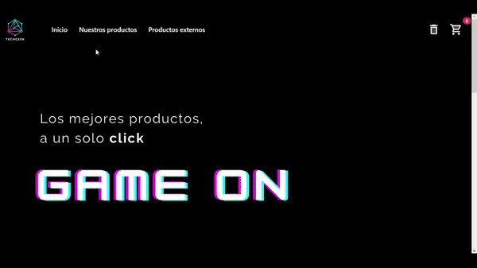

<h1> Tech Geek </h1>

Este sitio web fe creado utilizando HTML, CSS, Bootstrap y React JS

Se trata de una tienda de e-commerce, en donde se pueden conseguir tecnología gamer/ de computación.

El sitio web incluye una página de inicio, una de productos propios y otra de productos externos relacionados. Más específicamente: Navbar, Catálogo, Detalle de producto, Carro, Checkout, Formulario de compra, Confirmación.

Acá te dejamos un gif mostrando la navegabilidad básica del sitio:

Sitio web presentado como proyecto final 
CoderHouse - Curso de React JS
